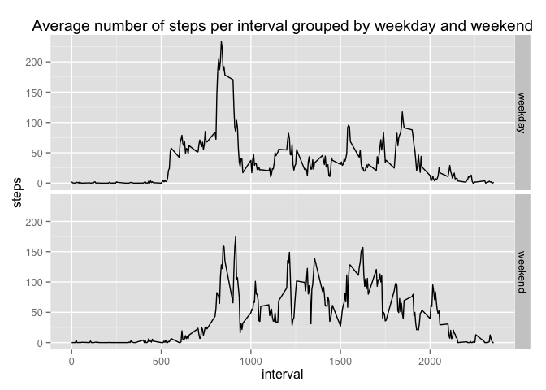

# Reproducible Research: Peer Assessment 1

## Setting up the environment

```r
setwd("~/git/RepData_PeerAssessment1")
library(dplyr)
```

```
## 
## Attaching package: 'dplyr'
## 
## The following object is masked from 'package:stats':
## 
##     filter
## 
## The following objects are masked from 'package:base':
## 
##     intersect, setdiff, setequal, union
```

```r
library(ggplot2)
```

## Loading and preprocessing the data

```r
act <- read.csv(unz('activity.zip', 'activity.csv'), stringsAsFactors = FALSE)
act <- tbl_df(act)
act$date <- as.Date(act$date)
```

## What is mean total number of steps taken per day?
We want to get an idea of the fequencies of the total numbers of steps each day. For
this we first create a table with the total number of steps taken per day.

```r
act.byDay <- act %>% 
            select(steps, date) %>%
            group_by(date) %>%
            summarize(steps = sum(steps, na.rm = TRUE))
```

With the data from this new table, we create a histogram with the base plotting 
system.

```r
with(act.byDay, hist(steps, 
                     breaks = 10, 
                     main = "Histogram of steps taken each day"))
```

 

Finally, we like to know the mean and median for total numbers of steps a day.

```r
actMean <- mean(act.byDay$steps, na.rm = TRUE)
actMedian <- median(act.byDay$steps, na.rm = TRUE)
```

So, we see that the mean is **9354.2295** and the median is **10395**.

## What is the average daily activity pattern?
To look for patterns in the average daily activity, we look at the average number
of steps per interval. We create a new table and a line plot of that table.

```r
act.byInterval <- act %>% 
    select(steps, interval) %>%
    group_by(interval) %>%
    summarize(steps = mean(steps, na.rm = TRUE))

with(act.byInterval, plot(interval, steps, 
                     type = 'l', 
                     main = "Average number of steps taken at 5-second interval"))
```

 

```r
actMaxInterval <- act.byInterval[act.byInterval$steps == max(act.byInterval$steps),]$interval
```
The interval with the most steps is at **835s**.

## Imputing missing values
To get an idea where the missing values are and how many, we calculate the
number of missing values (NA) and the percentage of missing values.

```r
missing <- colSums(is.na(act))
missingPerc <- colSums(is.na(act)/nrow(act)*100)
missing
```

```
##    steps     date interval 
##     2304        0        0
```

```r
missingPerc
```

```
##    steps     date interval 
## 13.11475  0.00000  0.00000
```
As you can see, only the steps column has missing values: **2304 rows** which is about **13%** of the total.

The strategy used for filling in the missing data is to use the average steps for
that 5-minute interval. This seems a reasonable strategy looking at the previous
line-plot and it does not have to be sophisticated.

Using this strategy, we create a new dataset that looks exactly like the original,
but where the NA are replaced by the mean in that interval.

```r
actNoNA <- act
isna.steps <- is.na(actNoNA$steps)
actNoNA$steps[isna.steps] <- 
    act.byInterval[act.byInterval$interval == actNoNA$interval[isna.steps],]$steps
```

With this new dataset, we create a histogram of the activity by day.

```r
actNoNA.byDay <- actNoNA %>% 
    select(steps, date) %>%
    group_by(date) %>%
    summarize(steps = sum(steps, na.rm = TRUE))

with(actNoNA.byDay, hist(steps, 
                     breaks = 10, 
                     main = "Histogram of steps taken each day (without NA's)"))
```

 

We also like to know the mean and median for total numbers of steps a day in this
new dataset.

```r
actMeanNoNA <- mean(actNoNA.byDay$steps, na.rm = TRUE)
actMedianNoNA <- median(actNoNA.byDay$steps, na.rm = TRUE)
```
For the dataset with replaced NA's the mean is **9530.7244** and the 
median is **10439**.

If we compare this with the mean and median of the dataset with NA's, resp. 9354.2295 and 10395, we see that for the new dataset 
the mean is about **176 steps higher** and the median is 
**44 steps** higher.

## Are there differences in activity patterns between weekdays and weekends?
A plot with two panels helps us to quickly see the difference in activity
patterns between weekdays and weekends.

```r
actNoNA.dayType <- actNoNA %>%
    mutate(daytype = as.factor( ifelse( 
        weekdays(date) %in% c('Saturday', 'Sunday'),
        'weekend', 'weekday') ) ) %>%
    select(daytype, steps, interval) %>%
    group_by(daytype, interval) %>%
    summarize(steps = mean(steps, na.rm = TRUE))

qplot(interval, steps, data = actNoNA.dayType, facets = daytype ~ ., geom = 'line') +
    ggtitle("Average number of steps per interval grouped by weekday and weekend")
```

 

Hereby we concluded the exploratory analysis of the activity data.
